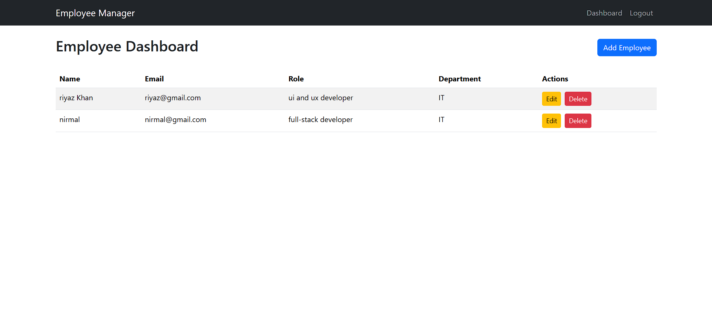

# MERN Machine Test - Internship at DealsDray

This repository contains the code for the MERN stack machine test.

---

## Live Demo

[Live URL](https://your-live-url.com)

---

## Installation

### Server Setup

1. Navigate to `server` folder:

   ```bash
   cd server
   npm install

   ```

2. Add `.env` file:

   ```bash
   DB_URL=your-mongo-db-uri
   ```

3. Start the `server`:

```bash
Copy code
npm start
```

### Client Setup

1. Navigate to `client` folder:

```bash
cd ../client
npm install
```

2. Add `.env` file:

```bash
VITE_BASE_URL=http://localhost:5000
```

3. Start the client:

```bash
npm run dev
```

### Credentials

- **Username:** godson
- **Password:** 123456

## Submission

- **Code:** [GitHub Repository](https://github.com/Godson2611/DEALSDRAY-task)
- **Video:** [Video Link](https://drive.google.com/file/d/1hCK6L79auhvUp61eVbpSAMZoreKedvnx/view?usp=sharing)
- **Screenshot:** 

### Tech Stack

- **Frontend:** React.js, Vite
- **Backend:** Node.js, Express
- **Database:** MongoDB

For assistance, email me at [godson2611@gmail.com](mailto:godson2611@gmail.com).
